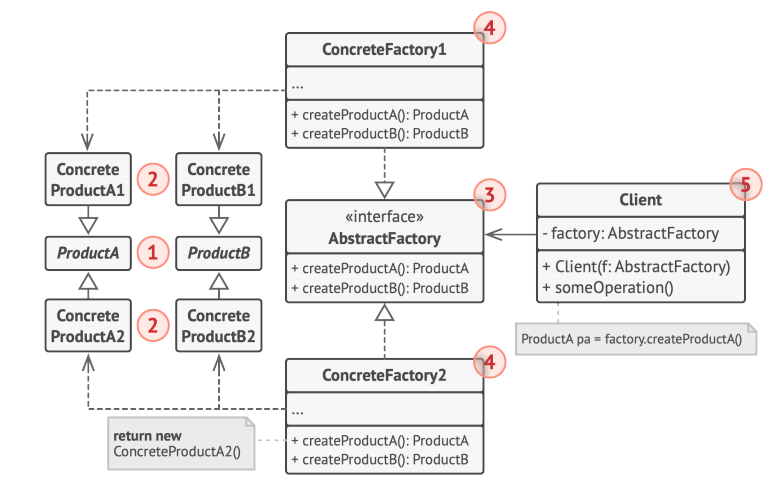

[TOC]


## 1. 设计模式入门

### 1.  首先明白面向对象


### 2. 什么是设计模式?

设计模式是软件设计中常见问题的典型解决方案。它们就像能根据需求进行调整的预制蓝图，可用于解决代码中反复出现的设计问题。

设计模式与方法或库的使用方式不同，很难直接程序中套用某个设计模式。模式并不是一段特定的代码，而是解决特定问题的一般性概念。可以根据模式来实现符合程序实际所需的解决

### 3. 设计原则

* 封装变化的内容

  * 找到程序中的变化内容并将其与不变的内容区分开。

    变化是程序员生命中唯一不变的事情。该原则的主要目的是将变更造成的影响最小化。将程序的变化部分放入独立的模块中，保护其他代码不受负面影响。只需花较少时间就能让程序恢复正常工作，或是实现并测试修改的内容。在修改程序上所花的时间越少，就会有更多时间来实现功能。

* 面向接口进行开发， 而不是面向实现

  * 面向接口进行开发，而不是面向实现；依赖于抽象类型，而不是具体类。

* 多用组合,少用继承

  * 组合是代替继承的一种方法。继承代表类之间的“是”关系 （汽车是交通工具），而组合则代表“有”关系（汽车有一个 引擎）。

### 4. 策略模式

* **策略模式**定义算法族(一系列算法)， 并将每种算法分别放入独立的类中封装起来，以使算法的对象能够相互替换。此模式让算法的变化独立于使用算法的客户

在示例中，我们将叫声行为(`quackBehavior`)和飞行行为(`flyBehavior`)作为接口从Duck类中独立了出来，并且我们面向了两个接口实现了不同的叫声行为类和飞行行为类，并通过将这些不同的行为类与Duck类组合起来生产出不同的类。同理可使用策略模式的场景还有：地图APP中计算路径策略(同一起点终点，不同出行方式)。

* 结构：

  

  1. **上下文**（Context）维护指向具体策略的引用，且仅通过策略接口与该对象进行交流。 
  2. **策略**（Strategy）接口是所有具体策略的通用接口，它声明 了一个上下文用于执行策略的方法。
  3. **具体策略**（Concrete Strategies）实现了上下文所用算法的各种不同变体。
  4. 当上下文需要运行算法时，它会在其已连接的策略对象上调用执行方法。上下文不清楚其所涉及的策略类型与算法的执行方式。 
  5. **客户端**（Client）会创建一个特定策略对象并将其传递给上下文。上下文则会提供一个设置器以便客户端在运行时替换相关联的策略。
  
* 示例代码:

  ```typescript
  /**
   * Strategy Design Pattern
   *
   * Intent: Lets you define a family of algorithms, put each of them into a
   * separate class, and make their objects interchangeable.
   */
  /**
   * The Context defines the interface of interest to clients.
   */
  var Context = /** @class */ (function () {
      /**
       * Usually, the Context accepts a strategy through the constructor, but also
       * provides a setter to change it at runtime.
       */
      function Context(strategy) {
          this.strategy = strategy;
      }
      /**
       * Usually, the Context allows replacing a Strategy object at runtime.
       */
      Context.prototype.setStrategy = function (strategy) {
          this.strategy = strategy;
      };
      /**
       * The Context delegates some work to the Strategy object instead of
       * implementing multiple versions of the algorithm on its own.
       */
      Context.prototype.doSomeBusinessLogic = function () {
          // ...
          console.log('Context: Sorting data using the strategy (not sure how it\'ll do it)');
          var result = this.strategy.doAlgorithm(['a', 'b', 'c', 'd', 'e']);
          console.log(result.join(','));
          // ...
      };
      return Context;
  }());
  /**
   * Concrete Strategies implement the algorithm while following the base Strategy
   * interface. The interface makes them interchangeable in the Context.
   */
  var ConcreteStrategyA = /** @class */ (function () {
      function ConcreteStrategyA() {
      }
      ConcreteStrategyA.prototype.doAlgorithm = function (data) {
          return data.sort();
      };
      return ConcreteStrategyA;
  }());
  var ConcreteStrategyB = /** @class */ (function () {
      function ConcreteStrategyB() {
      }
      ConcreteStrategyB.prototype.doAlgorithm = function (data) {
          return data.reverse();
      };
      return ConcreteStrategyB;
  }());
  /**
   * The client code picks a concrete strategy and passes it to the context. The
   * client should be aware of the differences between strategies in order to make
   * the right choice.
   */
  var context = new Context(new ConcreteStrategyA());
  console.log('Client: Strategy is set to normal sorting.');
  context.doSomeBusinessLogic();
  console.log('');
  console.log('Client: Strategy is set to reverse sorting.');
  context.setStrategy(new ConcreteStrategyB());
  context.doSomeBusinessLogic();
  ```

* 适合应用场景 

  * 当你想使用对象中各种不同的算法变体，并希望能在运行时切换算法时，可使用策略模式。

    > 策略模式让你能够将对象关联至可以不同方式执行特定子任 务的不同子对象，从而以间接方式在运行时更改对象行为。

  * 当你有许多仅在执行某些行为时略有不同的相似类时，可使用策略模式。

    > 策略模式让你能将不同行为抽取到一个独立类层次结构中， 并将原始类组合成同一个，从而减少重复代码。

  * 如果算法在上下文的逻辑中不是特别重要，使用该模式能将类的业务逻辑与其算法实现细节隔离开来。

    > 策略模式让你能将各种算法的代码、内部数据和依赖关系与 其他代码隔离开来。不同客户端可通过一个简单接口执行算法，并能在运行时进行切换。

  * 当类中使用了复杂条件运算符以在同一算法的不同变体中切换时，可使用该模式。

    > 策略模式将所有继承自同样接口的算法抽取到独立类中，因此不再需要条件语句。 原始对象并不实现所有算法的变体， 而是将执行工作委派给其中的一个独立算法对象。

* 实现方式

  1. 从上下文类中找出修改频率较高的算法（也可能是用于在运行时选择某个算法变体的复杂条件运算符）。
  2. 声明该算法所有变体的通用策略接口。
  3. 将算法逐一抽取到各自的类中，它们都必须实现策略接口。
  4. 在上下文类中添加一个成员变量用于保存对于策略对象的引 用。然后提供设置器以修改该成员变量。上下文仅可通过策 略接口同策略对象进行交互，如有需要还可定义一个接口来让策略访问其数据。
  5. 客户端必须将上下文类与相应策略进行关联，使上下文可以预期的方式完成其主要工作。

## 2. 观察者模式

* **观察者**是一种行为设计模式，允许你定义一种订阅机制，可在对象事件发生时通知多个“观察”该对象的其他对象。

  拥有一些值得关注的状态的对象通常被称为目标，由于它要将自身的状态改变通知给其他对象，我们也将其称为**发布者**（publisher）。所有希望关注发布者状态变化的其他对象被称 为**订阅者**（subscribers）。

  观察者模式建议为发布者类添加订阅机制，让每个对象都能订阅或取消订阅发布者事件流。实际上，该机制包括 1）一个用于存储订阅者对象引用的列表成员变量；2）几个用于添加或删除该列表中订阅者的公有方法。无论何时发生了重要的发布者事件，它都要遍历订阅者并调用其对象的特定通知方法。

* 实际使用场景: 事件监听机制, MVVM前端框架, 管理订阅系统等

* 结构

  

  


1. **发布者**（Publisher）会向其他对象发送值得关注的事件。事件会在发布者自身状态改变或执行特定行为后发生。发布者中包含一个允许新订阅者加入和当前订阅者离开列表的订阅 构架。 
2. 当新事件发生时，发送者会遍历订阅列表并调用每个订阅者对象的通知方法。该方法是在订阅者接口中声明的。 
3. **订阅者**（Subscriber）接口声明了通知接口。 在绝大多数情况下，该接口仅包含一个 update 更新方法。该方法可以拥有多个参数，使发布者能在更新时传递事件的详细信息。 
4. **具体订阅者**（Concrete Subscribers）可以执行一些操作来回应发布者的通知。 所有具体订阅者类都实现了同样的接口， 因此发布者不需要与具体类相耦合。 
5. 订阅者通常需要一些上下文信息来正确地处理更新。 因此， 发布者通常会将一些上下文数据作为通知方法的参数进行传递。发布者也可将自身作为参数进行传递，使订阅者直接获取所需的数据。 
6. **客户端**（Client）会分别创建发布者和订阅者对象，然后为订阅者注册发布者更新。

* 示例代码

  ```typescript
  /**
   * Observer Design Pattern
   *
   * Intent: Lets you define a subscription mechanism to notify multiple objects
   * about any events that happen to the object they're observing.
   *
   * Note that there's a lot of different terms with similar meaning associated
   * with this pattern. Just remember that the Subject is also called the
   * Publisher and the Observer is often called the Subscriber and vice versa.
   * Also the verbs "observe", "listen" or "track" usually mean the same thing.
   */
  
  /**
   * The Subject interface declares a set of methods for managing subscribers.
   */
  interface Subject {
      // Attach an observer to the subject.
      attach(observer: Observer): void;
  
      // Detach an observer from the subject.
      detach(observer: Observer): void;
  
      // Notify all observers about an event.
      notify(): void;
  }
  
  /**
   * The Subject owns some important state and notifies observers when the state
   * changes.
   */
  class ConcreteSubject implements Subject {
      /**
       * @type {number} For the sake of simplicity, the Subject's state, essential
       * to all subscribers, is stored in this variable.
       */
      public state: number;
  
      /**
       * @type {Observer[]} List of subscribers. In real life, the list of
       * subscribers can be stored more comprehensively (categorized by event
       * type, etc.).
       */
      private observers: Observer[] = [];
  
      /**
       * The subscription management methods.
       */
      public attach(observer: Observer): void {
          const isExist = this.observers.includes(observer);
          if (isExist) {
              return console.log('Subject: Observer has been attached already.');
          }
  
          console.log('Subject: Attached an observer.');
          this.observers.push(observer);
      }
  
      public detach(observer: Observer): void {
          const observerIndex = this.observers.indexOf(observer);
          if (observerIndex === -1) {
              return console.log('Subject: Nonexistent observer.');
          }
  
          this.observers.splice(observerIndex, 1);
          console.log('Subject: Detached an observer.');
      }
  
      /**
       * Trigger an update in each subscriber.
       */
      public notify(): void {
          console.log('Subject: Notifying observers...');
          for (const observer of this.observers) {
              observer.update(this);
          }
      }
  
      /**
       * Usually, the subscription logic is only a fraction of what a Subject can
       * really do. Subjects commonly hold some important business logic, that
       * triggers a notification method whenever something important is about to
       * happen (or after it).
       */
      public someBusinessLogic(): void {
          console.log('\nSubject: I\'m doing something important.');
          this.state = Math.floor(Math.random() * (10 + 1));
  
          console.log(`Subject: My state has just changed to: ${this.state}`);
          this.notify();
      }
  }
  
  /**
   * The Observer interface declares the update method, used by subjects.
   */
  interface Observer {
      // Receive update from subject.
      update(subject: Subject): void;
  }
  
  /**
   * Concrete Observers react to the updates issued by the Subject they had been
   * attached to.
   */
  class ConcreteObserverA implements Observer {
      public update(subject: Subject): void {
          if (subject instanceof ConcreteSubject && subject.state < 3) {
              console.log('ConcreteObserverA: Reacted to the event.');
          }
      }
  }
  
  class ConcreteObserverB implements Observer {
      public update(subject: Subject): void {
          if (subject instanceof ConcreteSubject && (subject.state === 0 || subject.state >= 2)) {
              console.log('ConcreteObserverB: Reacted to the event.');
          }
      }
  }
  
  /**
   * The client code.
   */
  
  const subject = new ConcreteSubject();
  
  const observer1 = new ConcreteObserverA();
  subject.attach(observer1);
  
  const observer2 = new ConcreteObserverB();
  subject.attach(observer2);
  
  subject.someBusinessLogic();
  subject.someBusinessLogic();
  
  subject.detach(observer2);
  
  subject.someBusinessLogic();
  ```

* 适合应用场景

  * 当一个对象状态的改变需要改变其他对象，或实际对象是事先未知的或动态变化的时，可使用观察者模式。

    > 观察者模式允许任何实现了订阅者接口的对象订阅发布者对象的事件通知。允许客户端通过自定义订阅类注入自定义代码。

  * 当应用中的一些对象必须观察其他对象时，可使用该模式。 但仅能在有限时间内或特定情况下使用。

    > 订阅列表是动态的，因此订阅者可随时加入或离开该列表。

* 实现方式

  1. 仔细检查业务逻辑，试着将其拆分为两个部分：独立于其他代码的核心功能将作为发布者；其他代码则将转化为一 组订阅类。
  2. 声明订阅者接口。该接口至少应声明一个 `update` 方法。
  3. 声明发布者接口并定义一些接口来在列表中添加和删除订阅对象。记住发布者必须仅通过订阅者接口与它们进行交互。
  4. 确定存放实际订阅列表的位置并实现订阅方法。通常所有类型的发布者代码看上去都一样，因此将列表放置在直接扩展 自发布者接口的抽象类中是显而易见的。具体发布者会扩展 该类从而继承所有的订阅行为。 但是，如果你需要在现有的类层次结构中应用该模式，则可以考虑使用组合的方式： 将订阅逻辑放入一个独立的对象， 然后让所有实际订阅者使用该对象。
  5. 创建具体发布者类。每次发布者发生了重要事件时都必须通 知所有的订阅者。
  6.  在具体订阅者类中实现通知更新的方法。绝大部分订阅者需要一些与事件相关的上下文数据。这些数据可作为通知方法的参数来传递。 但还有另一种选择。订阅者接收到通知后直接从通知中获取所有数据。在这种情况下，发布者必须通过更新方法将自身传递出去。另一种不太灵活的方式是通过构造函数将发布者与订阅者永久性地连接起来。
  7. 客户端必须生成所需的全部订阅者，并在相应的发布者处完成注册工作。

## 3. 装饰模式

* **装饰**是一种结构型设计模式， 允许你通过将对象放入包含行为的特殊封装对象中来为原对象绑定新的行为。

  当需要更改一个对象的行为时，第一个跳入脑海的想法就是扩展它所属的类。但是，不能忽视继承可能引发的几个 严重问题。 

  * 继承是静态的。你无法在运行时更改已有对象的行为，只能 使用由不同子类创建的对象来替代当前的整个对象。 
  * 子类只能有一个父类。大部分编程语言不允许一个类同时继 承多个类的行为。

  其中一种方法是用聚合或组合，而不是继承。两者的工作方式几乎一模一样： 一个对象包含指向另一个对象的引用， 并将部分工作委派给引用对象；继承中的对象则继承了父类 的行为，它们自己能够完成这些工作。 你可以使用这个新方法来轻松替换各种连接的“小帮手”对 象，从而能在运行时改变容器的行为。一个对象可以使用多个类的行为，包含多个指向其他对象的引用，并将各种工作 委派给引用对象。 聚合（或组合）是许多设计模式背后的关键原则（包括装饰在内）。

  > 聚合：对象 A 包含对象 B；B 可以独立于 A 存在。 
  >
  > 组合：对象 A 由对象 B 构成；A 负责管理 B 的生命周期。B 无法独立 于 A 存在。

  **封装器是装饰模式的别称**，这个称谓明确地表达了该模式的主要思想。“封装器”是一个能与其他“目标”对象连接的 对象。封装器包含与目标对象相同的一系列方法，它会将所有接收到的请求委派给目标对象。但是，封装器可以在将请 求委派给目标前后对其进行处理，所以可能会改变最终结果。

  那么什么时候一个简单的封装器可以被称为是真正的装饰呢？ 正如之前提到的，封装器实现了与其封装对象相同的接口。因此从客户端的角度来看，这些对象是完全一样的。封装器中的引用成员变量可以是遵循相同接口的任意对象。这使得可以将一个对象放入多个封装器中，并在对象中添加所有这些封装器的组合行为。

  只要所有装饰都遵循相同的接口， 客户端就可以使用任意自定义的装饰来装饰对象。

* 实际应用: `axios`拦截器

* 结构:

  

  1. **部件**（Component）声明封装器和被封装对象的公用接口。 
  2. **具体部件**（Concrete Component）类是被封装对象所属的类。 它定义了基础行为，但装饰类可以改变这些行为。 
  3. **基础装饰**（Base Decorator）类拥有一个指向被封装对象的引 用成员变量。该变量的类型应当被声明为通用部件接口，这样它就可以引用具体的部件和装饰。装饰基类会将所有操作委派给被封装的对象。
  4. **具体装饰类**（Concrete Decorators）定义了可动态添加到部件的额外行为。具体装饰类会重写装饰基类的方法，并在调用父类方法之前或之后进行额外的行为。 
  5. **客户端**（Client）可以使用多层装饰来封装部件，只要它能使用通用接口与所有对象互动即可。

* 示例代码

  ```typescript
  /**
   * Decorator Design Pattern
   *
   * Intent: Lets you attach new behaviors to objects by placing these objects
   * inside special wrapper objects that contain the behaviors.
   */
  
  /**
   * The base Component interface defines operations that can be altered by
   * decorators.
   */
  interface Component {
      operation(): string;
  }
  
  /**
   * Concrete Components provide default implementations of the operations. There
   * might be several variations of these classes.
   */
  class ConcreteComponent implements Component {
      public operation(): string {
          return 'ConcreteComponent';
      }
  }
  
  /**
   * The base Decorator class follows the same interface as the other components.
   * The primary purpose of this class is to define the wrapping interface for all
   * concrete decorators. The default implementation of the wrapping code might
   * include a field for storing a wrapped component and the means to initialize
   * it.
   */
  class Decorator implements Component {
      protected component: Component;
  
      constructor(component: Component) {
          this.component = component;
      }
  
      /**
       * The Decorator delegates all work to the wrapped component.
       */
      public operation(): string {
          return this.component.operation();
      }
  }
  
  /**
   * Concrete Decorators call the wrapped object and alter its result in some way.
   */
  class ConcreteDecoratorA extends Decorator {
      /**
       * Decorators may call parent implementation of the operation, instead of
       * calling the wrapped object directly. This approach simplifies extension
       * of decorator classes.
       */
      public operation(): string {
          return `ConcreteDecoratorA(${super.operation()})`;
      }
  }
  
  /**
   * Decorators can execute their behavior either before or after the call to a
   * wrapped object.
   */
  class ConcreteDecoratorB extends Decorator {
      public operation(): string {
          return `ConcreteDecoratorB(${super.operation()})`;
      }
  }
  
  /**
   * The client code works with all objects using the Component interface. This
   * way it can stay independent of the concrete classes of components it works
   * with.
   */
  function clientCode(component: Component) {
      // ...
  
      console.log(`RESULT: ${component.operation()}`);
  
      // ...
  }
  
  /**
   * This way the client code can support both simple components...
   */
  const simple = new ConcreteComponent();
  console.log('Client: I\'ve got a simple component:');
  clientCode(simple);
  console.log('');
  
  /**
   * ...as well as decorated ones.
   *
   * Note how decorators can wrap not only simple components but the other
   * decorators as well.
   */
  const decorator1 = new ConcreteDecoratorA(simple);
  const decorator2 = new ConcreteDecoratorB(decorator1);
  console.log('Client: Now I\'ve got a decorated component:');
  clientCode(decorator2);
  ```

* 适合应用场景

  * 如果你希望在无需修改代码的情况下即可使用对象，且希望在运行时为对象新增额外的行为，可以使用装饰模式。

    > 装饰能将业务逻辑组织为层次结构，可以为各层创建一个装饰，在运行时将各种不同逻辑组合成对象。由于这些对象都遵循通用接口，客户端代码能以相同的方式使用这些对象。

  * 如果用继承来扩展对象行为的方案难以实现或者根本不可行， 你可以使用该模式。

    > 许多编程语言使用 `final` "最终"关键字来限制对某个类的进 一步扩展。复用最终类已有行为的唯一方法是使用装饰模式： 用封装器对其进行封装。

* 实现方式

  1. 确保业务逻辑可用一个基本组件及多个额外可选层次表示。
  2. 找出基本组件和可选层次的通用方法。创建一个组件接口并在其中声明这些方法。
  3. 创建一个具体组件类，并定义其基础行为。
  4. 创建装饰基类，使用一个成员变量存储指向被封装对象的引 用。该成员变量必须被声明为组件接口类型，从而能在运行时连接具体组件和装饰。装饰基类必须将所有工作委派给被封装的对象。
  5. 确保所有类实现组件接口。
  6. 将装饰基类扩展为具体装饰。具体装饰必须在调用父类方法 （总是委派给被封装对象）之前或之后执行自身的行为。
  7. 客户端代码负责创建装饰并将其组合成客户端所需的形式。

## 4. 工厂模式

### 1. 工厂模式

* **工厂方法**是一种创建型设计模式， 其在父类中提供一个创建对象的方法，允许子类决定实例化对象的类型。

  工厂方法模式建议使用特殊的工厂方法代替对于对象构造函数的直接调用（即使用 new 运算符）。对象仍将通过 new 运算符创建，只是该运算符改在工厂方法中调用罢了。工厂方法返回的对象通常被称作“产品”。

  但有一点需要注意:仅当这些产品具有共同的基类或者接口时，子类才能返回不同类型的产品，同时基类中的工厂方法还应将其返回类型声明为这一共有接口。

* 结构

  

  1. **产品**（Product）将会对接口进行声明。对于所有由创建者及其子类构建的对象，这些接口都是通用的。
  2. **具体产品**（Concrete Products）是产品接口的不同实现。
  3. **创建者**（Creator）类声明返回产品对象的工厂方法。该方法的返回对象类型必须与产品接口相匹配。你可以将工厂方法声明为抽象方法，强制要求每个子类以不同方式实现该方法。或者，你也可以在基础工厂方法中返回默认产品类型。注意，尽管它的名字是创建者，但他最主要的职责并不是创建产品。一般来说，创建者类包含一些与产品相关的核心业务逻辑。工厂方法将这些逻辑处理从具体产品类中分离出来。
  4. **具体创建者**（Concrete Creators） 将会重写基础工厂方法，使其返回不同类型的产品。注意，并不一定每次调用工厂方法都会创建新的实例。工厂方法也可以返回缓存、对象池或其他来源的已有对象。

* 示例代码

  ```typescript
  /**
   * Factory Method Design Pattern
   *
   * Intent: Provides an interface for creating objects in a superclass, but
   * allows subclasses to alter the type of objects that will be created.
   */
  
  /**
   * The Creator class declares the factory method that is supposed to return an
   * object of a Product class. The Creator's subclasses usually provide the
   * implementation of this method.
   */
  abstract class Creator {
      /**
       * Note that the Creator may also provide some default implementation of the
       * factory method.
       */
      public abstract factoryMethod(): Product;
  
      /**
       * Also note that, despite its name, the Creator's primary responsibility is
       * not creating products. Usually, it contains some core business logic that
       * relies on Product objects, returned by the factory method. Subclasses can
       * indirectly change that business logic by overriding the factory method
       * and returning a different type of product from it.
       */
      public someOperation(): string {
          // Call the factory method to create a Product object.
          const product = this.factoryMethod();
          // Now, use the product.
          return `Creator: The same creator's code has just worked with ${product.operation()}`;
      }
  }
  
  /**
   * Concrete Creators override the factory method in order to change the
   * resulting product's type.
   */
  class ConcreteCreator1 extends Creator {
      /**
       * Note that the signature of the method still uses the abstract product
       * type, even though the concrete product is actually returned from the
       * method. This way the Creator can stay independent of concrete product
       * classes.
       */
      public factoryMethod(): Product {
          return new ConcreteProduct1();
      }
  }
  
  class ConcreteCreator2 extends Creator {
      public factoryMethod(): Product {
          return new ConcreteProduct2();
      }
  }
  
  /**
   * The Product interface declares the operations that all concrete products must
   * implement.
   */
  interface Product {
      operation(): string;
  }
  
  /**
   * Concrete Products provide various implementations of the Product interface.
   */
  class ConcreteProduct1 implements Product {
      public operation(): string {
          return '{Result of the ConcreteProduct1}';
      }
  }
  
  class ConcreteProduct2 implements Product {
      public operation(): string {
          return '{Result of the ConcreteProduct2}';
      }
  }
  
  /**
   * The client code works with an instance of a concrete creator, albeit through
   * its base interface. As long as the client keeps working with the creator via
   * the base interface, you can pass it any creator's subclass.
   */
  function clientCode(creator: Creator) {
      // ...
      console.log('Client: I\'m not aware of the creator\'s class, but it still works.');
      console.log(creator.someOperation());
      // ...
  }
  
  /**
   * The Application picks a creator's type depending on the configuration or
   * environment.
   */
  console.log('App: Launched with the ConcreteCreator1.');
  clientCode(new ConcreteCreator1());
  console.log('');
  
  console.log('App: Launched with the ConcreteCreator2.');
  clientCode(new ConcreteCreator2());
  ```


* 适合应用场景

  * 当你在编写代码的过程中，如果无法预知对象确切类别及其 依赖关系时，可使用工厂方法。

    > 工厂方法将创建产品的代码与实际使用产品的代码分离，从而能在不影响其他代码的情况下扩展产品创建部分代码。

  * 如果你希望用户能扩展你软件库或框架的内部组件，可使用工厂方法。

  * 如果你希望复用现有对象来节省系统资源，而不是每次都重新创建对象，可使用工厂方法。

* 实现方式

  1. 让所有产品都遵循同一接口。该接口必须声明对所有产品都有意义的方法。
  2. 在创建类中添加一个空的工厂方法。该方法的返回类型必须遵循通用的产品接口。 
  3. 在创建者代码中找到对于产品构造函数的所有引用。将它们依次替换为对于工厂方法的调用，同时将创建产品的代码移入工厂方法。可能需要在工厂方法中添加临时参数来控制返回的产品类型。 工厂方法的代码看上去可能非常糟糕。其中可能会有复杂的 switch 分支运算符，用于选择各种需要实例化的产品类。 但是不要担心，很快就会修复这个问题。 
  4. 现在，为工厂方法中的每种产品编写一个创建者子类，然后在子类中重写工厂方法，并将基本方法中的相关创建代码移动到工厂方法中。
  5. 如果应用中的产品类型太多，那么为每个产品创建子类并无太大必要，这时也可以在子类中复用基类中的控制参数。 
  6. 如果代码经过上述移动后，基础工厂方法中已经没有任何代码，可以将其转变为抽象类。如果基础工厂方法中还有其他语句，可以将其设置为该方法的默认行为。

### 2. 抽象工厂模式

* **抽象工厂**是一种创建型设计模式， 它能创建一系列相关的对象，而无需指定其具体类。抽象工厂模式通常基于一组工厂方法，但你也可以使用**原型模式**来生成这些类的方法。

  首先，抽象工厂模式建议为系列中的每件产品明确声明接口。然后，确保所有产品变体都继承这些接口。

  接下来，需要声明抽象工厂——包含系列中所有产品构造方法的接口。这些方法必须返回抽象产品类型，即之前抽取的那些接口。

  对于系列产品的每个变体，都将基于抽象工厂接口创建不同的工厂类。每个工厂类都只能返回特定类别的产品。

  客户端代码可以通过相应的抽象接口调用工厂和产品类。无需修改实际客户端代码，就能更改传递给客户端的工厂类， 也能更改客户端代码接收的产品变体。

  最后一点说明：如果客户端仅接触抽象接口，那么谁来创建实际的工厂对象呢？一般情况下，应用程序会在初始化阶段创建具体工厂对象。而在此之前，应用程序必须根据配置文件或环境设定选择工厂类别。

* 结构

  

1. **抽象产品**（Abstract Product）为构成系列产品的一组不同但 相关的产品声明接口。 
2. **具体产品**（Concrete Product）是抽象产品的多种不同类型实 现。所有变体都必须实现相应的抽象产品。 
3. **抽象工厂**（Abstract Factory）接口声明了一组创建各种抽象 产品的方法。 
4. **具体工厂**（Concrete Factory）实现抽象工厂的构建方法。每 个具体工厂都对应特定产品变体，且仅创建此种产品变体。
5. 尽管具体工厂会对具体产品进行初始化，其构建方法签名必须返回相应的抽象产品。这样，使用工厂类的客户端代码就不会与工厂创建的特定产品变体耦合。客户端（Client）只 需通过抽象接口调用工厂和产品对象，就能与任何具体工厂/ 产品变体交互。

* 示例代码

  ```typescript
  /**
   * Abstract Factory Design Pattern
   *
   * Intent: Lets you produce families of related objects without specifying their
   * concrete classes.
   */
  
  /**
   * The Abstract Factory interface declares a set of methods that return
   * different abstract products. These products are called a family and are
   * related by a high-level theme or concept. Products of one family are usually
   * able to collaborate among themselves. A family of products may have several
   * variants, but the products of one variant are incompatible with products of
   * another.
   */
  interface AbstractFactory {
      createProductA(): AbstractProductA;
  
      createProductB(): AbstractProductB;
  }
  
  /**
   * Concrete Factories produce a family of products that belong to a single
   * variant. The factory guarantees that resulting products are compatible. Note
   * that signatures of the Concrete Factory's methods return an abstract product,
   * while inside the method a concrete product is instantiated.
   */
  class ConcreteFactory1 implements AbstractFactory {
      public createProductA(): AbstractProductA {
          return new ConcreteProductA1();
      }
  
      public createProductB(): AbstractProductB {
          return new ConcreteProductB1();
      }
  }
  
  /**
   * Each Concrete Factory has a corresponding product variant.
   */
  class ConcreteFactory2 implements AbstractFactory {
      public createProductA(): AbstractProductA {
          return new ConcreteProductA2();
      }
  
      public createProductB(): AbstractProductB {
          return new ConcreteProductB2();
      }
  }
  
  /**
   * Each distinct product of a product family should have a base interface. All
   * variants of the product must implement this interface.
   */
  interface AbstractProductA {
      usefulFunctionA(): string;
  }
  
  /**
   * These Concrete Products are created by corresponding Concrete Factories.
   */
  class ConcreteProductA1 implements AbstractProductA {
      public usefulFunctionA(): string {
          return 'The result of the product A1.';
      }
  }
  
  class ConcreteProductA2 implements AbstractProductA {
      public usefulFunctionA(): string {
          return 'The result of the product A2.';
      }
  }
  
  /**
   * Here's the the base interface of another product. All products can interact
   * with each other, but proper interaction is possible only between products of
   * the same concrete variant.
   */
  interface AbstractProductB {
      /**
       * Product B is able to do its own thing...
       */
      usefulFunctionB(): string;
  
      /**
       * ...but it also can collaborate with the ProductA.
       *
       * The Abstract Factory makes sure that all products it creates are of the
       * same variant and thus, compatible.
       */
      anotherUsefulFunctionB(collaborator: AbstractProductA): string;
  }
  
  /**
   * These Concrete Products are created by corresponding Concrete Factories.
   */
  class ConcreteProductB1 implements AbstractProductB {
  
      public usefulFunctionB(): string {
          return 'The result of the product B1.';
      }
  
      /**
       * The variant, Product B1, is only able to work correctly with the variant,
       * Product A1. Nevertheless, it accepts any instance of AbstractProductA as
       * an argument.
       */
      public anotherUsefulFunctionB(collaborator: AbstractProductA): string {
          const result = collaborator.usefulFunctionA();
          return `The result of the B1 collaborating with the (${result})`;
      }
  }
  
  class ConcreteProductB2 implements AbstractProductB {
  
      public usefulFunctionB(): string {
          return 'The result of the product B2.';
      }
  
      /**
       * The variant, Product B2, is only able to work correctly with the variant,
       * Product A2. Nevertheless, it accepts any instance of AbstractProductA as
       * an argument.
       */
      public anotherUsefulFunctionB(collaborator: AbstractProductA): string {
          const result = collaborator.usefulFunctionA();
          return `The result of the B2 collaborating with the (${result})`;
      }
  }
  
  /**
   * The client code works with factories and products only through abstract
   * types: AbstractFactory and AbstractProduct. This lets you pass any factory or
   * product subclass to the client code without breaking it.
   */
  function clientCode(factory: AbstractFactory) {
      const productA = factory.createProductA();
      const productB = factory.createProductB();
  
      console.log(productB.usefulFunctionB());
      console.log(productB.anotherUsefulFunctionB(productA));
  }
  
  /**
   * The client code can work with any concrete factory class.
   */
  console.log('Client: Testing client code with the first factory type...');
  clientCode(new ConcreteFactory1());
  
  console.log('');
  
  console.log('Client: Testing the same client code with the second factory type...');
  clientCode(new ConcreteFactory2());
  ```

* 适合应用场景 

  * 如果代码需要与多个不同**系列**的相关产品交互，但是由于无法提前获取相关信息，或者出于对未来扩展性的考虑，不希望代码基于产品的具体类进行构建，在这种情况下，你可以使用抽象工厂。
  * 如果有一个基于一组抽象方法的类，且其主要功能因此变得不明确，那么在这种情况下可以考虑使用抽象工厂模式。

* 实现方式

  1. 以不同的产品类型与产品变体为维度绘制矩阵。
  2. 为所有产品声明抽象产品接口。然后让所有具体产品类实现这些接口。 
  3. 声明抽象工厂接口，并且在接口中为所有抽象产品提供一组构建方法。 
  4. 为每种产品变体实现一个具体工厂类。
  5. 在应用程序中开发初始化代码。该代码根据应用程序配置或当前环境，对特定具体工厂类进行初始化。然后将该工厂对象传递给所有需要创建产品的类。 
  6. 找出代码中所有对产品构造函数的直接调用，将其替换为对工厂对象中相应构建方法的调用。

