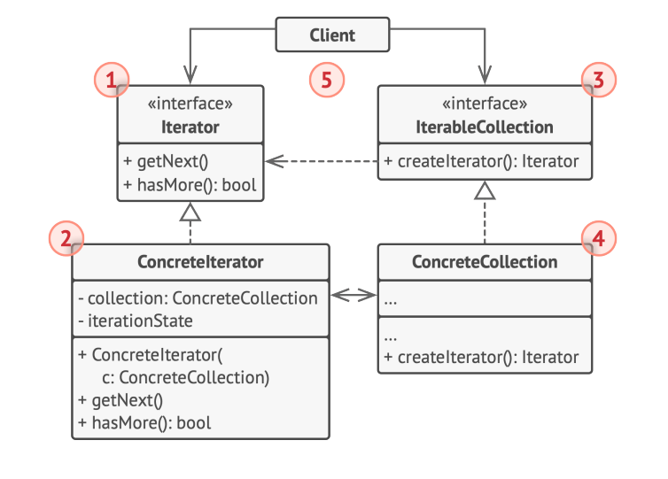
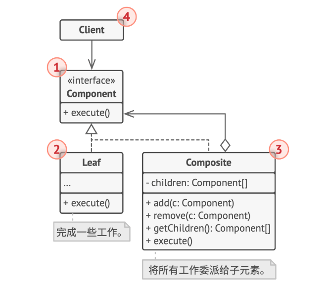
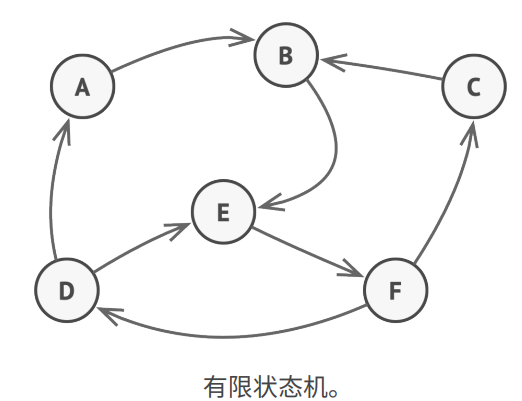
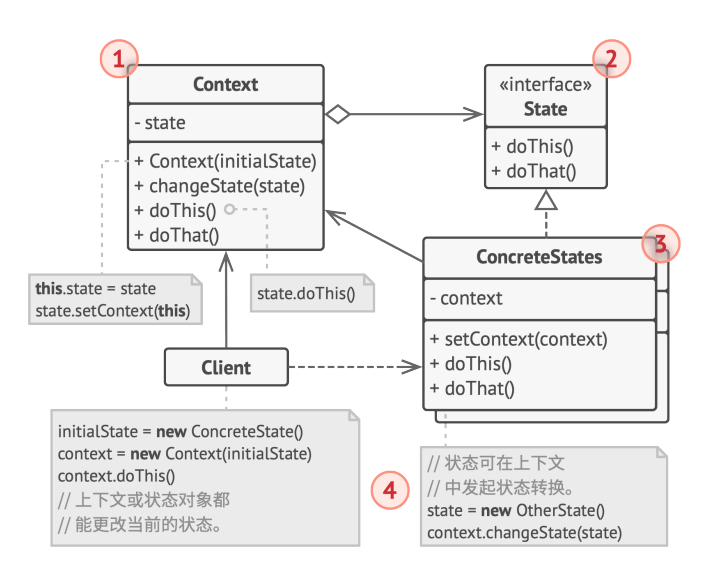

## 1.迭代器模式

* **迭代器**是一种行为设计模式，让你能在不暴露集合底层表现形式（列表、栈和树等）的情况下遍历集合中所有的元素。

  > 集合是编程中最常使用的数据类型之一。尽管如此，集合只是一组对象的容器而已。
  >
  > 无论集合的构成方式如何，它都必须提供某种访问元素的方式，便于其他代码使用其中的元素。集合应提供一种能够遍历元素的方式，且保证它不会周而复始地访问同一个元素。

* 迭代器模式的主要思想是将集合的遍历行为抽取为单独的**迭代器对象**。

  除实现自身算法外，迭代器还封装了遍历操作的所有细节，例如当前位置和末尾剩余元素的数量。因此，多个迭代器可以在相互独立的情况下同时访问集合。

  迭代器通常会提供一个获取集合元素的基本方法。客户端可不断调用该方法直至它不返回任何内容，这意味着迭代器已经遍历了所有元素。

  所有迭代器必须实现相同的接口。这样一来，只要有合适的迭代器，客户端代码就能兼容任何类型的集合或遍历算法。如果你需要采用特殊方式来遍历集合，只需创建一个新的迭代器类即可，无需对集合或客户端进行修改。

* 结构:

  

  1. 迭代器（Iterator）接口声明了遍历集合所需的操作：获取下一个元素、获取当前位置和重新开始迭代等。
  2. 具体迭代器（ConcreteIterators）实现遍历集合的一种特定算法。迭代器对象必须跟踪自身遍历的进度。这使得多个迭代器可以相互独立地遍历同一集合。
  3. 集合（Collection）接口声明一个或多个方法来获取与集合兼容的迭代器。请注意，返回方法的类型必须被声明为迭代器接口，因此具体集合可以返回各种不同种类的迭代器。
  4. 具体集合（ConcreteCollections）会在客户端请求迭代器时返回一个特定的具体迭代器类实体。你可能会琢磨，剩下的集合代码在什么地方呢？不用担心，它也会在同一个类中。只是这些细节对于实际模式来说并不重要，所以我们将其省略了而已。
  5. 客户端（Client）通过集合和迭代器的接口与两者进行交互。这样一来客户端无需与具体类进行耦合，允许同一客户端代码使用各种不同的集合和迭代器。客户端通常不会自行创建迭代器，而是会从集合中获取。但在特定情况下，客户端可以直接创建一个迭代器（例如当客户端需要自定义特殊迭代器时）。

* 具体实现:

  ```typescript
  /**
   * Iterator Design Pattern
   *
   * Intent: Lets you traverse elements of a collection without exposing its
   * underlying representation (list, stack, tree, etc.).
   */
  
  interface Iterator<T> {
      // Return the current element.
      current(): T;
  
      // Return the current element and move forward to next element.
      next(): T;
  
      // Return the key of the current element.
      key(): number;
  
      // Checks if current position is valid.
      valid(): boolean;
  
      // Rewind the Iterator to the first element.
      rewind(): void;
  }
  
  interface Aggregator {
      // Retrieve an external iterator.
      getIterator(): Iterator<string>;
  }
  
  /**
   * Concrete Iterators implement various traversal algorithms. These classes
   * store the current traversal position at all times.
   */
  
  class AlphabeticalOrderIterator implements Iterator<string> {
      private collection: WordsCollection;
  
      /**
       * Stores the current traversal position. An iterator may have a lot of
       * other fields for storing iteration state, especially when it is supposed
       * to work with a particular kind of collection.
       */
      private position: number = 0;
  
      /**
       * This variable indicates the traversal direction.
       */
      private reverse: boolean = false;
  
      constructor(collection: WordsCollection, reverse: boolean = false) {
          this.collection = collection;
          this.reverse = reverse;
  
          if (reverse) {
              this.position = collection.getCount() - 1;
          }
      }
  
      public rewind() {
          this.position = this.reverse ?
              this.collection.getCount() - 1 :
              0;
      }
  
      public current(): string {
          return this.collection.getItems()[this.position];
      }
  
      public key(): number {
          return this.position;
      }
  
      public next(): string {
          const item = this.collection.getItems()[this.position];
          this.position += this.reverse ? -1 : 1;
          return item;
      }
  
      public valid(): boolean {
          if (this.reverse) {
              return this.position >= 0;
          }
  
          return this.position < this.collection.getCount();
      }
  }
  
  /**
   * Concrete Collections provide one or several methods for retrieving fresh
   * iterator instances, compatible with the collection class.
   */
  class WordsCollection implements Aggregator {
      private items: string[] = [];
  
      public getItems(): string[] {
          return this.items;
      }
  
      public getCount(): number {
          return this.items.length;
      }
  
      public addItem(item: string): void {
          this.items.push(item);
      }
  
      public getIterator(): Iterator<string> {
          return new AlphabeticalOrderIterator(this);
      }
  
      public getReverseIterator(): Iterator<string> {
          return new AlphabeticalOrderIterator(this, true);
      }
  }
  
  /**
   * The client code may or may not know about the Concrete Iterator or Collection
   * classes, depending on the level of indirection you want to keep in your
   * program.
   */
  const collection = new WordsCollection();
  collection.addItem('First');
  collection.addItem('Second');
  collection.addItem('Third');
  
  const iterator = collection.getIterator();
  
  console.log('Straight traversal:');
  while (iterator.valid()) {
      console.log(iterator.next());
  }
  
  console.log('');
  console.log('Reverse traversal:');
  const reverseIterator = collection.getReverseIterator();
  while (reverseIterator.valid()) {
      console.log(reverseIterator.next());
  }
  
  ```

  

  

## 2.组合模式

* 组合是一种结构型设计模式，你可以使用它将对象组合成树状结构，并且能像使用独立对象一样使用它们。

* 如果应用的核心模型能用树状结构表示，在应用中使用组合模式才有价值。该方式的最大优点在于你无需了解构成树状结构的对象的具体类。你只需调用通用接口以相同的方式对其进行处理即可。当你调用该方法后，对象会将请求沿着树结构传递下去。

* 结构:

  

  1. 组件（Component）接口描述了树中简单项目和复杂项目所共有的操作。
  2. 叶节点（Leaf）是树的基本结构，它不包含子项目。一般情况下，叶节点最终会完成大部分的实际工作，因为它们无法将工作指派给其他部分。
  3. 容器（Container）——又名“组合（Composite）”——是包含叶节点或其他容器等子项目的单位。容器不知道其子项目所属的具体类，它只通过通用的组件接口与其子项目交互。容器接收到请求后会将工作分配给自己的子项目，处理中间结果，然后将最终结果返回给客户端。
  4. 客户端（Client）通过组件接口与所有项目交互。因此，客户端能以相同方式与树状结构中的简单或复杂项目交互。

* 具体实现:

  ```typescript
  /**
   * Composite Design Pattern
   *
   * Intent: Lets you compose objects into tree structures and then work with
   * these structures as if they were individual objects.
   */
  
  /**
   * The base Component class declares common operations for both simple and
   * complex objects of a composition.
   */
  abstract class Component {
      protected parent: Component;
  
      /**
       * Optionally, the base Component can declare an interface for setting and
       * accessing a parent of the component in a tree structure. It can also
       * provide some default implementation for these methods.
       */
      public setParent(parent: Component) {
          this.parent = parent;
      }
  
      public getParent(): Component {
          return this.parent;
      }
  
      /**
       * In some cases, it would be beneficial to define the child-management
       * operations right in the base Component class. This way, you won't need to
       * expose any concrete component classes to the client code, even during the
       * object tree assembly. The downside is that these methods will be empty
       * for the leaf-level components.
       */
      public add(component: Component): void { }
  
      public remove(component: Component): void { }
  
      /**
       * You can provide a method that lets the client code figure out whether a
       * component can bear children.
       */
      public isComposite(): boolean {
          return false;
      }
  
      /**
       * The base Component may implement some default behavior or leave it to
       * concrete classes (by declaring the method containing the behavior as
       * "abstract").
       */
      public abstract operation(): string;
  }
  
  /**
   * The Leaf class represents the end objects of a composition. A leaf can't have
   * any children.
   *
   * Usually, it's the Leaf objects that do the actual work, whereas Composite
   * objects only delegate to their sub-components.
   */
  class Leaf extends Component {
      public operation(): string {
          return 'Leaf';
      }
  }
  
  /**
   * The Composite class represents the complex components that may have children.
   * Usually, the Composite objects delegate the actual work to their children and
   * then "sum-up" the result.
   */
  class Composite extends Component {
      protected children: Component[] = [];
  
      /**
       * A composite object can add or remove other components (both simple or
       * complex) to or from its child list.
       */
      public add(component: Component): void {
          this.children.push(component);
          component.setParent(this);
      }
  
      public remove(component: Component): void {
          const componentIndex = this.children.indexOf(component);
          this.children.splice(componentIndex, 1);
  
          component.setParent(null);
      }
  
      public isComposite(): boolean {
          return true;
      }
  
      /**
       * The Composite executes its primary logic in a particular way. It
       * traverses recursively through all its children, collecting and summing
       * their results. Since the composite's children pass these calls to their
       * children and so forth, the whole object tree is traversed as a result.
       */
      public operation(): string {
          const results = [];
          for (const child of this.children) {
              results.push(child.operation());
          }
  
          return `Branch(${results.join('+')})`;
      }
  }
  
  /**
   * The client code works with all of the components via the base interface.
   */
  function clientCode(component: Component) {
      // ...
  
      console.log(`RESULT: ${component.operation()}`);
  
      // ...
  }
  
  /**
   * This way the client code can support the simple leaf components...
   */
  const simple = new Leaf();
  console.log('Client: I\'ve got a simple component:');
  clientCode(simple);
  console.log('');
  
  /**
   * ...as well as the complex composites.
   */
  const tree = new Composite();
  const branch1 = new Composite();
  branch1.add(new Leaf());
  branch1.add(new Leaf());
  const branch2 = new Composite();
  branch2.add(new Leaf());
  tree.add(branch1);
  tree.add(branch2);
  console.log('Client: Now I\'ve got a composite tree:');
  clientCode(tree);
  console.log('');
  
  /**
   * Thanks to the fact that the child-management operations are declared in the
   * base Component class, the client code can work with any component, simple or
   * complex, without depending on their concrete classes.
   */
  function clientCode2(component1: Component, component2: Component) {
      // ...
  
      if (component1.isComposite()) {
          component1.add(component2);
      }
      console.log(`RESULT: ${component1.operation()}`);
  
      // ...
  }
  
  console.log('Client: I don\'t need to check the components classes even when managing the tree:');
  clientCode2(tree, simple);
  
  ```

  

## 3.状态模式

* 状态是一种行为设计模式，让你能在一个对象的内部状态变化时改变其行为，使其看上去就像改变了自身所属的类一样。

* 状态模式与**有限状态机**的概念紧密相关。

  

  其主要思想是程序在任意时刻仅可处于几种有限的状态中。在任何一个特定状态中，程序的行为都不相同，且可瞬间从一个状态切换到另一个状态。不过，根据当前状态，程序可能会切换到另外一种状态，也可能会保持当前状态不变。这些数量有限且预先定义的状态切换规则被称为转移。

  状态机通常由众多条件运算符（if或switch）实现，可根据对象的当前状态选择相应的行为。“状态”通常只是对象中的一组成员变量值。

* 状态模式建议为对象的所有可能状态新建一个类，然后将所有状态的对应行为抽取到这些类中。原始对象被称为上下文（context），它并不会自行实现所有行为，而是会保存一个指向表示当前状态的状态对象的引用，且将所有与状态相关的工作委派给该对象。

  如需将上下文转换为另外一种状态，则需将当前活动的状态对象替换为另外一个代表新状态的对象。采用这种方式是有前提的：所有状态类都必须遵循同样的接口，而且上下文必须仅通过接口与这些对象进行交互。

  这个结构可能看上去与策略模式相似，但有一个关键性的不同——在状态模式中，特定状态知道其他所有状态的存在，且能触发从一个状态到另一个状态的转换；策略则几乎完全不知道其他策略的存在。

* 结构:

  

  1. 上下文（Context）保存了对于一个具体状态对象的引用，并会将所有与该状态相关的工作委派给它。上下文通过状态接口与状态对象交互，且会提供一个设置器用于传递新的状态对象。
  2. 状态（State）接口会声明特定于状态的方法。这些方法应能被其他所有具体状态所理解，因为你不希望某些状态所拥有的方法永远不会被调用。
  3. 具体状态（ConcreteStates）会自行实现特定于状态的方法。为了避免多个状态中包含相似代码，你可以提供一个封装有部分通用行为的中间抽象类。状态对象可存储对于上下文对象的反向引用。状态可以通过该引用从上下文处获取所需信息，并且能触发状态转移。
  4. 上下文和具体状态都可以设置上下文的下个状态，并可通过替换连接到上下文的状态对象来完成实际的状态转换。

* 具体实现:

  ```typescript
  /**
   * State Design Pattern
   *
   * Intent: Lets an object alter its behavior when its internal state changes. It
   * appears as if the object changed its class.
   */
  
  /**
   * The Context defines the interface of interest to clients. It also maintains a
   * reference to an instance of a State subclass, which represents the current
   * state of the Context.
   */
  class Context {
      /**
       * @type {State} A reference to the current state of the Context.
       */
      private state: State;
  
      constructor(state: State) {
          this.transitionTo(state);
      }
  
      /**
       * The Context allows changing the State object at runtime.
       */
      public transitionTo(state: State): void {
          console.log(`Context: Transition to ${(<any>state).constructor.name}.`);
          this.state = state;
          this.state.setContext(this);
      }
  
      /**
       * The Context delegates part of its behavior to the current State object.
       */
      public request1(): void {
          this.state.handle1();
      }
  
      public request2(): void {
          this.state.handle2();
      }
  }
  
  /**
   * The base State class declares methods that all Concrete State should
   * implement and also provides a backreference to the Context object, associated
   * with the State. This backreference can be used by States to transition the
   * Context to another State.
   */
  abstract class State {
      protected context: Context;
  
      public setContext(context: Context) {
          this.context = context;
      }
  
      public abstract handle1(): void;
  
      public abstract handle2(): void;
  }
  
  /**
   * Concrete States implement various behaviors, associated with a state of the
   * Context.
   */
  class ConcreteStateA extends State {
      public handle1(): void {
          console.log('ConcreteStateA handles request1.');
          console.log('ConcreteStateA wants to change the state of the context.');
          this.context.transitionTo(new ConcreteStateB());
      }
  
      public handle2(): void {
          console.log('ConcreteStateA handles request2.');
      }
  }
  
  class ConcreteStateB extends State {
      public handle1(): void {
          console.log('ConcreteStateB handles request1.');
      }
  
      public handle2(): void {
          console.log('ConcreteStateB handles request2.');
          console.log('ConcreteStateB wants to change the state of the context.');
          this.context.transitionTo(new ConcreteStateA());
      }
  }
  
  /**
   * The client code.
   */
  const context = new Context(new ConcreteStateA());
  context.request1();
  context.request2();
  
  ```

  